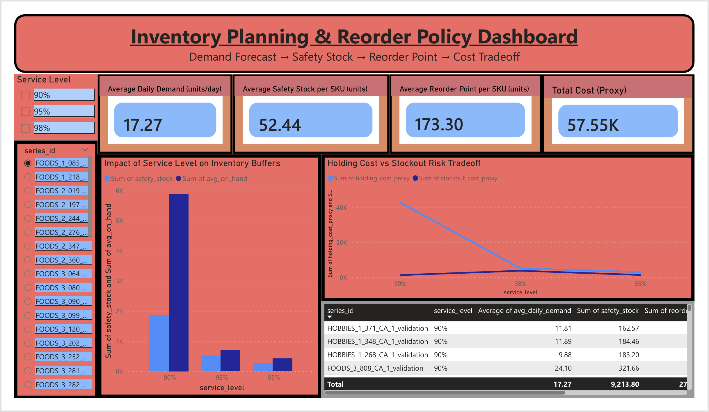

# Inventory Planning & Reorder Policy Optimization

**From Demand Forecasting to Cost-Optimal Replenishment Decisions**

## Problem

Retail inventory teams must balance **service level vs inventory cost** under demand uncertainty.
This project builds an **end-to-end planning workflow** that converts forecast accuracy into **safety stock, reorder points, and cost-optimal service level decisions** at the SKU level.

---

## What I Built

An integrated analytics pipeline that:

* Evaluates **forecast accuracy per SKU**
* Translates demand variability into **safety stock**
* Computes **reorder points** across service levels (90 / 95 / 98%)
* Simulates inventory policies to quantify **holding vs stockout trade-offs**
* Produces **SKU-level reorder recommendations**
* Visualizes decisions in an **executive Power BI dashboard**

---

## Key Decisions Enabled

* Which service level minimizes **total inventory cost** per SKU?
* Where does higher service level stop paying off?
* How does forecast error propagate into inventory buffers?
* Which SKUs are most sensitive to demand volatility?

---

## Approach (Concise)

### Demand Forecasting

* Baseline vs ETS-style models
* Accuracy evaluated using **sMAPE**
* Best model selected per SKU

### Inventory Logic

* Lead time: 7 days
* Safety stock:
  `Z × σ(demand during lead time)`
* Reorder point:
  `mean demand during lead time + safety stock`

### Policy Simulation

* 365-day simulation per SKU × service level
* `(ROP, S)` replenishment logic
* Cost proxies:

  * Holding cost per unit/day
  * Stockout penalty per unit

---

## Results

* Higher service levels reduce stockouts but increase holding cost non-linearly
* For most SKUs, **90–95% service level minimized total cost**
* Incremental benefit beyond 95% service level diminished rapidly
* Demand variability was the dominant driver of safety stock size

---

## Dashboard Highlights (Power BI)

* KPI cards: demand, safety stock, reorder point, total cost
* Service-level trade-off visuals
* SKU-level drill-down with controlled interactions
* Designed for **planner / ops manager decision-making**


---

## Tech Stack

* **Python**: pandas, numpy, statistical inventory formulas
* **Jupyter**: modular analysis notebooks
* **Power BI**: interactive planning dashboard
* **Data modeling**: fact-dimension thinking applied to analytics outputs

---

## Project Structure

```text
notebooks/
  ├── demand_forecasting.ipynb
  └── inventory_planning.ipynb

outputs/
  ├── forecasts/
  ├── inventory_planning/
  └── figures/

powerbi/
  └── inventory_planning_dashboard.pbix
```


## Author

**Suhasi Sunil Gadge**
MS in Computer Science
Focus: Data Analytics · Supply Chain · Operations Analytics

